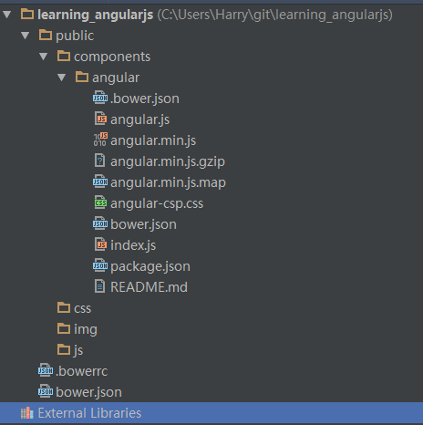

# AngularJS的第一步

在前面的章节，我们已经创建好了项目，并配置好了bower工具。本章开始，我们将进入正式的学习使用AngularJS的过程。首先，我们将从安装AngularJS开始。

## 在项目中安装AngularJS的基本库
[AngularJS官网](https://angularjs.org/)提供了通过Bower安装的命令行，我们需要做的，就是在WebStorm的命令行工具中，运行如下命令：

```bash
$ bower install angular#1.5.0-rc.0 --save
```

结果如下所示：
```bash
>bower install angular#1.5.0-rc.0 --save

bower angular#1.5.0-rc.0        cached git://github.com/angular/bower-angular.git#1.5.0-rc.0
bower angular#1.5.0-rc.0      validate 1.5.0-rc.0 against git://github.com/angular/bower-angular.git#1.5.0-rc.0
bower angular#1.5.0-rc.0        cached git://github.com/angular/bower-angular.git#1.5.0-rc.0
bower angular#1.5.0-rc.0      validate 1.5.0-rc.0 against git://github.com/angular/bower-angular.git#1.5.0-rc.0
bower angular#1.5.0-rc.0       install angular#1.5.0-rc.0

angular#1.5.0-rc.0 public\components\angular
```

**命令解释**

这行命令告诉bower在这个项目中安装angular#1.5.0-rc.0，也即是AngularJS的1.5.0-rc.0版本（当前的最新版本）。

**--save标志**
这个额外的标志，是告诉bower把我们的安装记录放置入*bower.json*文件。这样，我们以后可以直接通过bower对此项目使用的AngularJS或其他库进行更新。

此时，当我们打开*bower.json*，我们会发现文档中的内容变多了，如下所示：

```json
//bower.json
{
  "name": "learning_angularjs",
  "dependencies": {
    "angular": "1.5.0-rc.0"
  }
}
```

同时，项目中会多出./public/components/angular目录，所有的AngularJS的文件都在这个目录中存放。



## 建立index.html文件
在*./public*目录下建立index.html文件（右键public目录，New > HTML File，然后输入index，点击OK）。WebStorm会自动帮助我们加入基本的HTML内容。

```html
<!DOCTYPE html>
<html lang="zh">
<head>
    <meta charset="UTF-8">
    <title>学习AngularJS 1.x</title>
</head>
<body>

</body>
</html>
```

我将lang从en改为了zh，标明此网站是简体中文的。同时调整了title。HTML的基础并不属于本书的范围，因此不在此细述。

## 引入AngularJS的库文件
引入AngularJS库文件很简单，一行HTML语言加入HTML的head部分即可：
```html
<script type="text/JavaScript" src="components/angular/angular.js"></script>
```

注：这里引入的angular.js是完整的版本（1M大小），如果在运行环境中，您应该将angular.js替换为angular.min.js（148KB）。


>小贴士：
>将js文件放在head部分和body部分有何区别？
>
>放在head部分的JavaScript文件，会在body渲染完毕后才开始执行。从AngularJS工作的特性来看，推荐所有的JavaScript文件都放在body部分引入。


## 第一个程序Hello World
是时候来测试下我们是否成功的引入了AngularJS了。我们在<body>元素中加入一个ng-app=""，然后加入一行代码"{{"Hello World!"}}"。如下所示:

```html
<!DOCTYPE html>
<html lang="zh">
<head>
    <meta charset="UTF-8">
    <title>学习AngularJS 1.x</title>
</head>
<body ng-app="">
    <h1>{{"Hello World!"}}</h1>
    <script type="text/JavaScript" src="components/angular/angular.js"></script>
</body>
</html>
```

## 运行Hello World
右键选择*index.html*，然后选择 run "index.html" ，然后你就可以在新打开的浏览器中看到运行的效果。


>如果浏览器没有自动打开？

>我在Windows电脑上遇到了相同的问题，请将WebStorm使用管理员权限打开。


运行效果如下图所示：


看不到“{ {”和“} }”，就说明AngularJS已经成功运行起来了！

如果AngularJS没有成功运行，那么您看到的应该是如下内容：

```
{{"Hello World!"}}
```

如果出现以上结果，请您按书的前面内容仔细检查您的代码。

Hello World到此结束，下面我们将进入AngularJS的世界，学习它，理解它，使用它！
